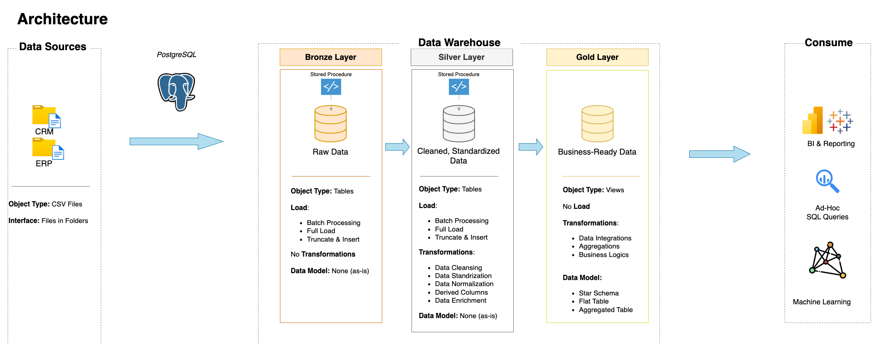
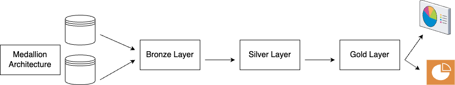

# PostgreSQL-Data-Warehouse-Project

Welcome to this **PostegreSQL Data Warehouse Project**. 
This repository has all the steps I took to build this project, from data warehouse, the architecture to generating actionable insights. This project highlights some of the best practices I learned in data engineering and data analytics. 

## Requirements for this Project

### Building the Data Warehouse 

### Objective
Develop a modern data warehouse using PostgreSQL to consolidate sales data, enabling analytical reporting and informed decision-making.

### Specifications
- **Data Sources**: Import data from two source systems (ERP and CRM) provided as CSV files.
- **Data Quality**: Cleaning and resolve data quality issues prior to analysis.
- **Integration**: Combine both sources into a single, user-friendly data model designed for analytical queries.
- **Scope**: Focus on the latest dataset only; historization of data is not required.
- **Documentation**: Provide clear documentation of the data model to support both business stakeholders and analytics teams.

---
## Data Architecture

Medallion Architecture is a modern data engineering design pattern used primarily in lakehouse environments, such as those built on Databricks, Delta Lake, or cloud-based data lakes. It follows a layered approach to data organization, improving data quality, governance, and efficiency by structuring data into different tiers: Bronze, Silver, and Gold.

1. **The Bronze Layer** is the raw data ingestion layer, where data is collected in its native format from various sources, such as APIs, IoT devices, databases, or logs. This layer ensures data immutability, allowing analysts to trace the original source.
2. **The Silver Layer** focuses on data cleansing, transformation, and enrichment, eliminating duplicates, handling missing values, and applying schema validation. This layer prepares data for analytical processing.
3. **The Gold Layer** contains highly refined, business-ready data that is aggregated, structured, and optimized for consumption in reports, dashboards, or machine learning models.

By implementing the Medallion Architecture, organizations can enhance data quality, lineage tracking, and query performance while maintaining flexibility. This approach also supports incremental data processing, where updates are seamlessly integrated into the pipeline, making it ideal for real-time analytics and AI-driven insights.

## Project Overview

For this projects the steps involved are:

1. **Data Architecture**: To design a modern data warehouse. For this we will be using the Medallion Architecture, which involves **Bronze**, **Silver** and **Gold** layers.
2. **ETL Pipelines**: How to extract, transform and load the data from differnce hources into out warehouse.
3. **Data Modeling**: Develop fact and dimension tables to help with the analytics queries.
4. **Analytics & Reporting**: Creating reports and/or dashboards for data driven decissions.

In this repository you fill find resources on:
- SQL Deelopment
- Data Architecture
- Data Engineering
- ETL Pipeline Development
- Data Modeling
- Data Analytics

## Notion Project

**[Notion Project Steps](https://www.notion.so/PostgreSQL-Data-Warehouse-Project-1b1c5e91e0d680b1b92bd9288f993ef4?pvs=4)**

## License

This project is licensed under the [MIT License](LICENSE). You are free to use, modify, and share this project with proper attribution.

## About me

Hey, my name is **Wil Garcia Rivera**, I have spent the better part of my adult life working in the finance and accounting realm. My main goal is to modernize these financial processes and enhanced them with modern data tools. Please feel free to send me note, lets connect and hopefully grown together in this space.
